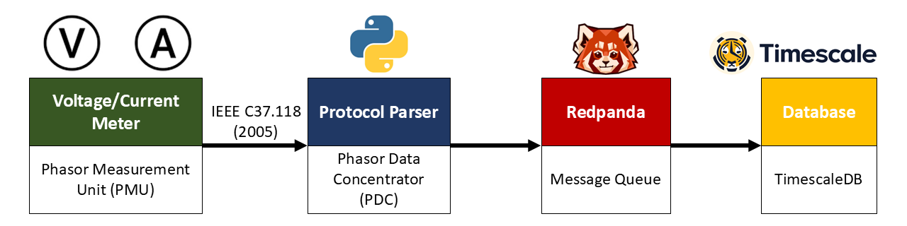

# Data Bridging from PMUs to Redpanda
This project is designed to bridge data from phasor measurement units (PMUs) to Redpanda. The goal is to facilitate the transfer and processing of PMU data in a real-time streaming environment.

## Overview
The data bridging process involves extracting PMU data, transforming it into a suitable format, and then loading it into Redpanda for real-time analytics and processing.

- **Phasor Measurement Unit (PMU)**: A device used to measure the electrical parameters on an electricity grid in real-time data. It sends data over the network in C37.118 format.

- **Phasor Data Concentrator (PDC)**: A system that collects data from multiple PMUs and aggregates it for further processing or transmission.

- **Redpanda**: A high-performance streaming platform that is designed for real-time data processing.

- **TimescaleDB**: A time-series database built on PostgreSQL that is suitable for real-time data ingestion and querying.

## Study Guideline
To effectively implement the data bridging project, you should review the following topics:

### 1. Basic Networking
- Understand how IP addressing works.
- Understand about port numbers and their significance in network communication.

### 2. Docker
- Understand how to build Docker images for your applications.
- Understand how to create Docker containers (including port exposure).

### 3. Other
- Python programming
- Docker Compose
- Basic SQL queries (optional)