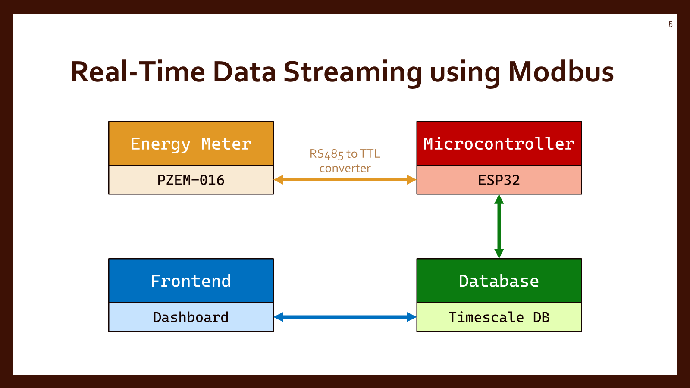

# Real-Time Data Streaming using Modbus Protocol

## 🧭 Overview
This project demonstrates how to implement real-time data streaming using the **Modbus RTU** protocol with an **ESP32** microcontroller. The system collects power and energy consumption data from a **PZEM-016** energy meter and sends it to a database for logging and visualization.

---

## 🔧 Key Components

- **ESP32**: Acts as the Modbus RTU master to communicate with the PZEM-016.
- **PZEM-016**: A Modbus-enabled energy meter that provides voltage, current, frequency, power, and energy readings.
- **Modbus Protocol**: Used for reliable serial communication between ESP32 and PZEM-016.
- **Database**: Stores collected data for historical analysis.
- **Visualization**: Visualizes real-time and historical data using tools like Grafana or a custom dashboard.

---

## 📘 Study Guideline

To fully understand and implement the system, you should study the following topics:

### 1. 🔌 Modbus Protocol
- What is **Modbus** and how does it work?
- What are the differences between **Modbus RTU** (serial-based) and **Modbus TCP** (network-based)?
- How are Modbus registers, function codes, and communication sequences structured?

### 2. 🔧 UART (Universal Asynchronous Receiver/Transmitter)
- What is UART and what are its key features?
- What are the important **UART configuration parameters** (baud rate, data bits, parity, stop bits)?
- On the **ESP32-S2 Cucumber board**, how many UART ports are available and which GPIO pins can be used for RX/TX?

### 3. ⚙️ Hardware vs Software Serial
- What is the difference between **HardwareSerial** and **SoftwareSerial**?
- How do these relate to the underlying UART hardware on ESP32?
- When should you prefer hardware serial over software serial?

### 4. ⚡ PZEM-016 Energy Meter
- What parameters does the **PZEM-016** report (e.g., voltage, current, power, energy)?
- How do you wire the PZEM-016 safely to measure AC power?
- What is the **physical meaning** of each measured value?
- What are the relevant **Modbus parameters** required to query the PZEM-016?

### 5. 🔄 System Architecture
- Design the communication flow between:
  - ESP32 and PZEM-016
  - ESP32 and the database/server
  - Database and visualization tool
- Define responsibilities of each module and how data flows end-to-end.

---

## 📚 Useful Resources

1. **PZEM-016 Datasheet**  
   [📄 Download PDF](Assets/PZEM-016.pdf)  
   Describes sensor register addresses, Modbus command structure, electrical specifications, and communication protocol.

2. **Pzem016Test GitHub Repository**  
   [🔗 Visit Repository](https://github.com/EvertDekker/Pzem016Test)  
   A practical example showing how to communicate with the PZEM-016 using an ESP32. Includes sample code and configuration tips.