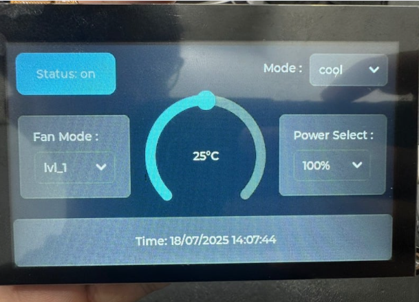

# Smart Air Conditioner Control  
**IoT Project: CEPT IoT Internship**

---

## 🎯 Objective

The project aims to develop two interfaces for controlling an air conditioning unit within a LAN:

1. **API Interface** for integration with an Energy Management System (EMS), enabling load control and energy optimization  
2. **GUI Interface** for local user interaction  

The system will ensure real-time status updates of the AC, maintaining synchronized control between both interfaces.

---

## 📡 Overview

---

## 🔧 System Workflow

The Smart AC system operates 2 ways that starts from the air conditioner itself and ends with the user receiving updates and starts from the user and ends with the air conditioner receiving commands :

1. **ESP8266 talk to AC** 
 [🔗 View Repository](https://github.com/ormsport/ToshibaCarrierHvac)
   - We use custom library to write code to communicate with AC via UART and upload code by using wifi OTA (Over-The-Air)
   - So no need to use ladder except for first time upload by updating the firmware or software of a device wirelessly over a WiFi network

2. **Wiring ESP8266 and AC pinout**  
   - Using Logic level shifter between AC pinout (5 V) and GPIO (3.3 V)

3. **Design MQTT topic**  
   - For get status: ESP8266 and user publishes/subscribes to topic esp01/hvac/status
   - For send command: User and ESP8266 publishes/subscribes to topic esp01/hvac/set

4. **Design API route**  
GET route (get status)
   - Subscribe to MQTT topic to get status in JSON format
POST route (post command)
   - Publish command to MQTT topic in JSON format
   - Have authorization to authorize user before send command

5. **Control Unit**  
[🔗 View Repository](https://github.com/thelastoutpostworkshop/JC4827W543_LVGLv9)
   - Using  LVGL - Light and Versatile Graphics Library ti design GUI interfce
   - Publish command to MQTT topic to control AC
   - Subscribe MQTT topic and update real time on screen

5. **Cloud Forwards Data to User Interface**  
   - Mobile apps or dashboards subscribe to the MQTT topic  
   - The user sees updated AC status in real time on the app

--- 
## 📚 Supported Features
### 1. Send command by user
   • state - on/off
   • set point - 16to30°C
   • Mode -auto, cool, dry, fan_only
   • Fanmode -quiet, lvl_1-5, auto
   • Swing -fix, v_swing, h_swing, hv_swing, fix_pos_1-5 
   • Purifier off,on
   • Power select -50%,75%,100%

### 2. User get AC status
    Including from the previous
   • room temp
   • outside temp

- Able to control AC via MQTT protocol
- Control unit can update real time status

---

## Manual for API interface
### 1. to get AC's status
      use http://<IP Address>:<PORT>/get route to get AC's status

### 2. to send command to AC
      - Use http://<IP Address>:<PORT>/set route to set AC's function
      - Send is JSON format for example : {"state" : "on",
                                          "setpoint" : 24}
      - Have to Authorize by enter username and password in header 
         (Now Authorization system is just verify by list in API code.Default username and password is user1 and password1)
      - From QoS1 when you POST command, It may show error but command is already sent.

