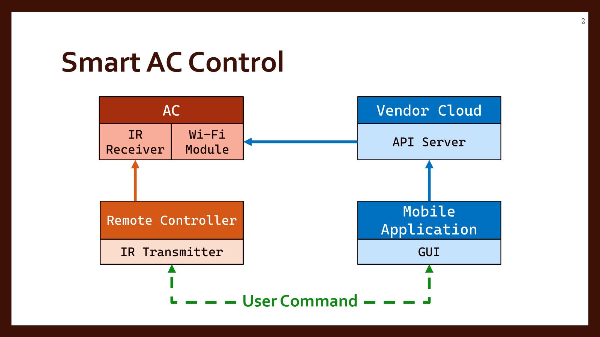
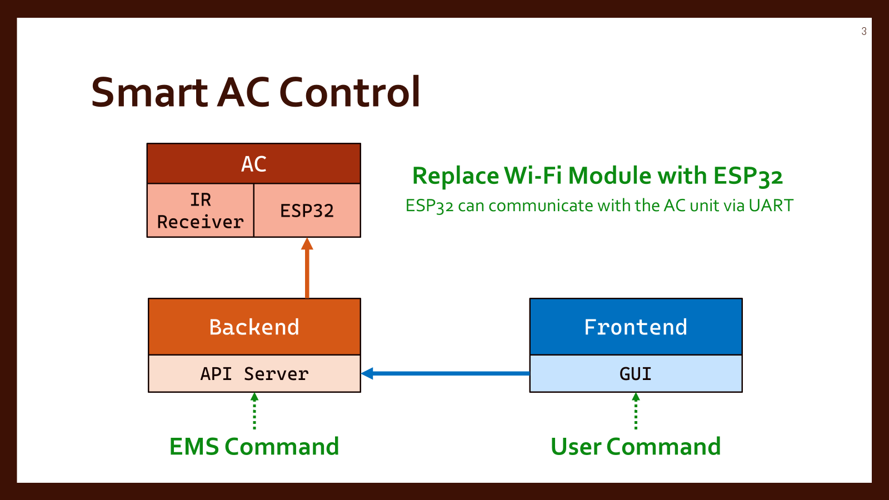

# Smart Air Condition Control

## 🧭 Overview

Traditional air conditioner (AC) systems are typically controlled via:
- **Infrared (IR) remote controllers**, or
- **Mobile applications** that communicate through the vendor's cloud service.

In both cases, the command path involves multiple layers — from the user to the cloud, and then back to the AC’s internal Wi-Fi module. This indirect method introduces latency and dependency on internet connectivity and vendor APIs.

To integrate air conditioning units into a local **Energy Management System (EMS)** for grid load control, a faster and more reliable control method is required. This project aims to:

- **Bypass the cloud**, allowing direct local control of AC units over a local network (LAN)
- **Interface EMS with ACs** to stabilize the power grid based on real-time energy data
- Use an **ESP32 microcontroller** to receive commands and forward them to the AC via **UART**
- Optionally provide a **Graphical User Interface (GUI)** for manual user control

---

## 📘 Study Guideline

To effectively implement and maintain the system, the following questions and topics should be studied:

### 1. ❄️ Controllable Parameters of Carrier XInverter AC
- What parameters can be **controlled or monitored** via the physical remote or mobile application?
- What is the **"POWER-SELECTION"** feature?
  - What levels can be set?
  - How does changing this setting affect the AC’s performance and energy consumption?

### 2. 📱 Mobile Application Integration
- How does the AC unit pair with the **official mobile application**?
- What **credentials** are required to link the app with the AC unit?

### 3. ⚡ EMS Load Control Purpose
- Why does an **Energy Management System (EMS)** need to control the AC load?
- What are the typical scenarios in which the EMS should intervene to limit power consumption, and when should it allow full user control of the AC?

### 4. 🌐 Networking Basics
- What is the difference between a **public** and **private network**?
- Why should control communication be kept within a **Local Area Network (LAN)**?
- What network settings must be configured so that the **EMS server** and **ESP32 device** can discover and communicate with each other?

### 5. 🔐 Access Control Design
- What is **access control**, and why is it important in local systems?
- What access control strategy should be applied in this system?
- How to prevent unauthorized control or misuse of the AC unit?

### 6. 🔧 UART Basics
- What is **UART (Universal Asynchronous Receiver/Transmitter)**?
- What are key features and key configurations

### 7. 🚏 API Route Design
- Based on the available commands, how should the API be structured?

### 8. 🔄 System Data Flow Design
- How does data move between the system components? **user or EMS** → **API server** → **ESP32** → **AC unit**

---

## 📚 Useful Resources

1. **Carrier XInverter User Manual**  
   [📄 View Manual](https://carrierthailand.com/wp-content/uploads/2024/02/MANUAL-XInverter-Plus-2024.pdf)  
   Provides information on available commands, settings, and configuration options supported by the Carrier XInverter AC unit.

2. **Toshiba-AC-control (GitHub)**  
   [🔗 View Repository](https://github.com/KaSroka/Toshiba-AC-control)  
   A Python script that replicates the functionality of the mobile app by sending commands to the Carrier Cloud API. Although it bypasses the GUI, it still depends on the vendor’s cloud infrastructure.

3. **ToshibaCarrierHvac (GitHub)**  
   [🔗 View Repository](https://github.com/ormsport/ToshibaCarrierHvac)  
   Implements a library for direct **serial communication** with Toshiba/Carrier AC units using ESP32 or ESP8266. Also includes a custom **PCB design** for hardware integration.

4. **esphome-toshiba-hvac-controller (GitHub)**  
   [🔗 View Repository](https://github.com/florianbrede-ayet/esphome-toshiba-hvac-controller)  
   Uses **ESPHome** to control Toshiba/Carrier AC units over serial communication. Designed to integrate with **Home Assistant**, offering a built-in GUI for control and monitoring.
