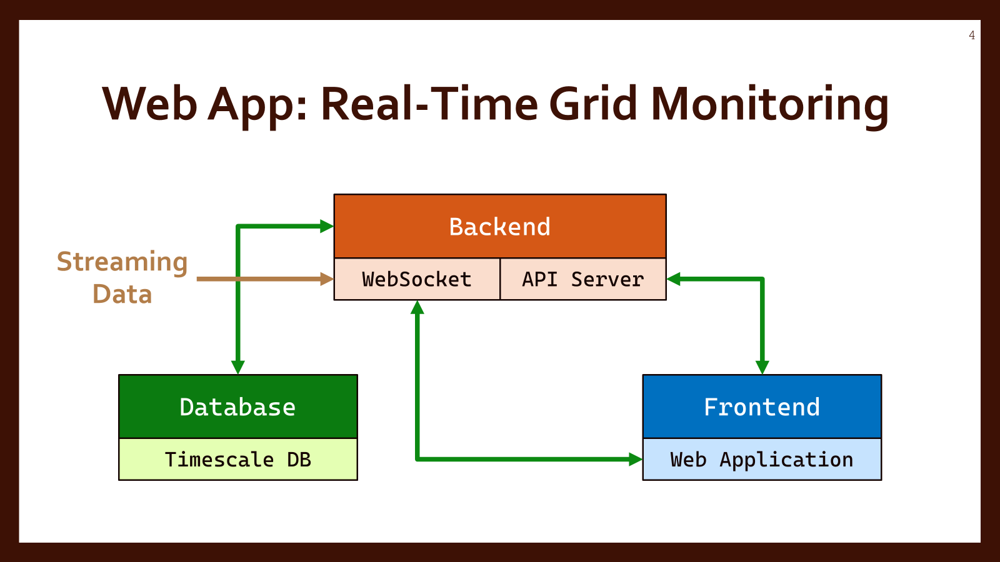

# Web Application for Real-Time Power Grid Monitoring

## 🧭 Overview

This project aims to develop a **web application** for monitoring real-time power grid operations. The system is designed to provide both **live data streaming** and access to **historical data** for analysis, diagnostics, and visualization.

To achieve this, the application consists of a well-structured **frontend** and **backend**, each playing a distinct role:

- The **frontend** provides an intuitive user interface to view live grid metrics, visualize trends, and explore past data.
- The **backend** handles data ingestion, storage, and communication with the frontend via both **HTTP APIs** and **WebSocket** connections to support real-time updates.

### 📊 Key Features
- **Real-Time Data Monitoring**: Uses WebSocket to push live grid metrics to the frontend with minimal latency.
- **Historical Data Access**: Exposes RESTful API endpoints to retrieve and visualize historical grid data.
- **Time-Series Database**: Utilizes **TimeScaleDB**, a PostgreSQL extension optimized for time-series data, to store both streaming and archived measurements efficiently.

## 📘 Study Guideline

- Research existing **EMS dashboards** or **energy monitoring systems** to identify the key parameters commonly displayed.  
  - For example, explore the [EMS Dashboard by GRID ENERGY](https://grid.com/en/energy/harness-the-power-of-the-sun-maximizing-energy-efficiency-with-our-advanced-ems-dashboard).

- Gain a basic understanding and importances of the **physical meaning** behind these parameters.

- Set up a simple web application to familiarize yourself with frontend-backend interaction:  
  - Use **Express.js** to create the backend server.  
  - Use **React.js** to build the frontend interface.  
  - Implement basic **GET** and **POST** requests from React to Express to enable communication between frontend and backend.
  - Once the setup is working, try querying the database from the backend

## 📚 Useful Resources

1. Explore the official documentation and beginner tutorials to get started with [Express.js](https://expressjs.com/) and [React.js](https://react.dev/), and look for introductory YouTube videos on building basic Express and React applications.