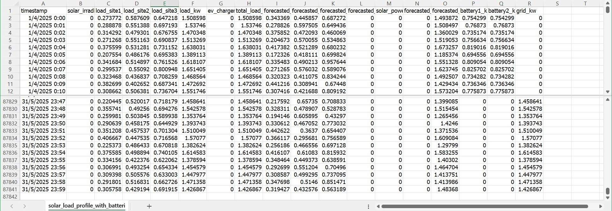
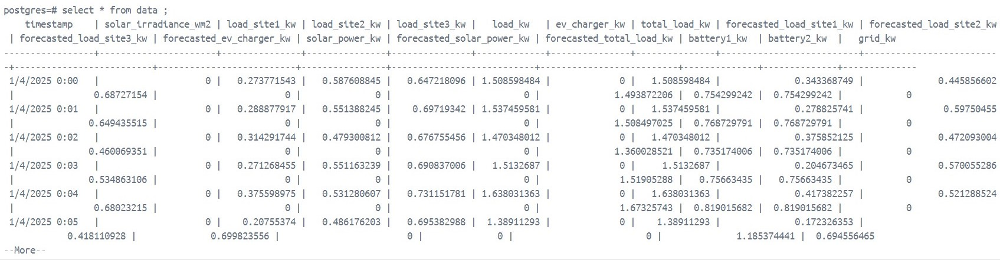
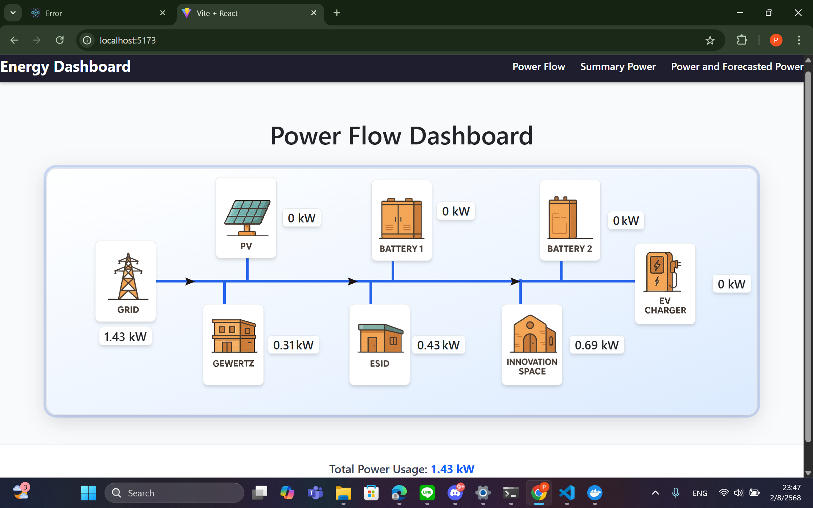
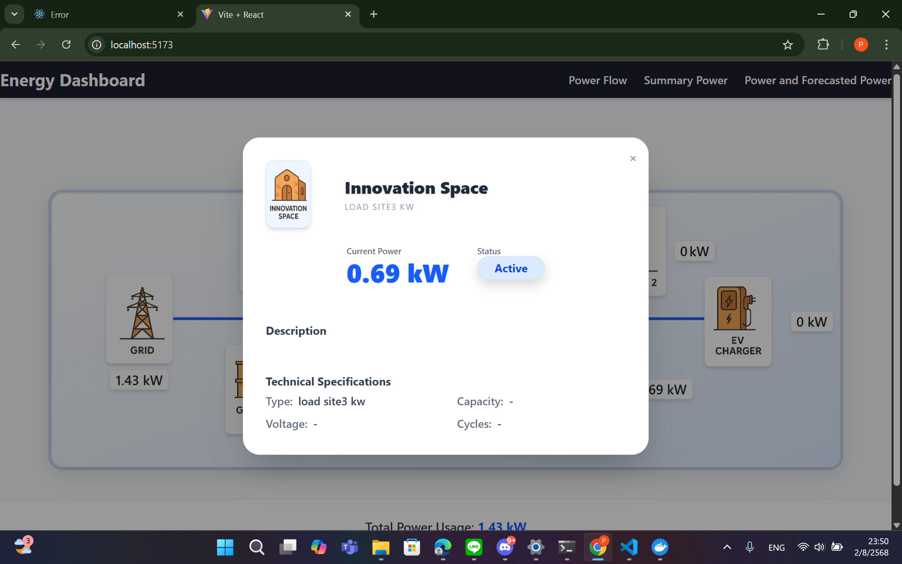
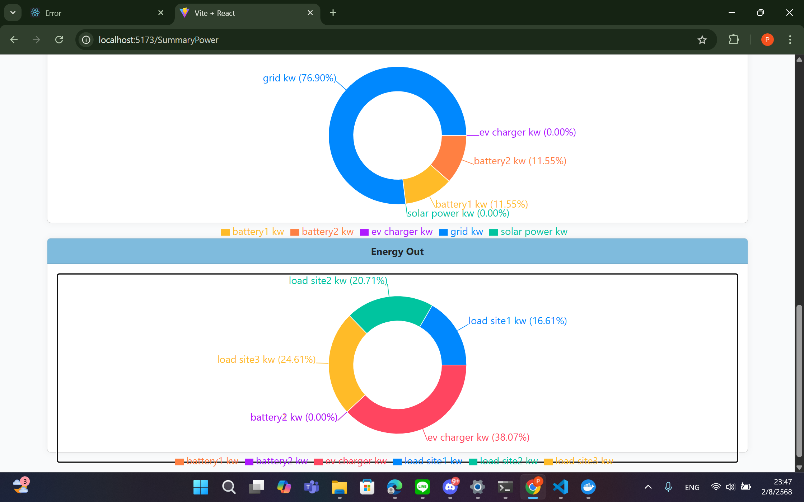
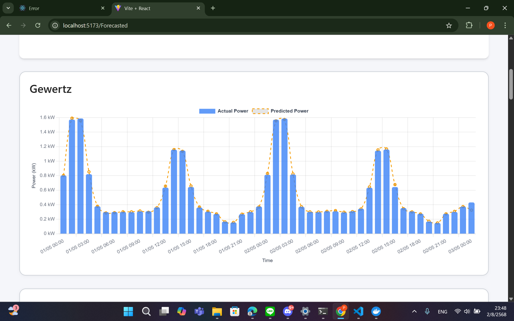
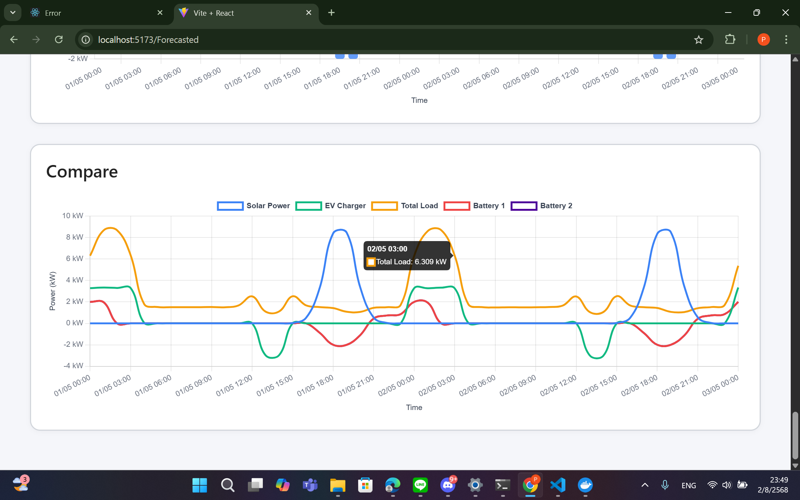

# Web Application for Real-Time Power Grid Monitoring

## Member

- Phattiran Krusatayanon
- Benyapa Cheewachuen
- Nonthapat Mahapromrak
- Metheewat Monthatip
- Manatnatee Chusap

## 0: Background
บริเวณ Gewertz Square มีการใช้พลังงานไฟฟ้าในหลายจุด เช่น อาคารสำนักงาน สถานีชาร์จรถยนต์ไฟฟ้า ระบบกักเก็บพลังงาน และโหลดไฟฟ้าอื่น ๆ  มีลักษณะแตกต่างกัน ส่งผลให้เกิดความซับซ้อนในการบริหารจัดการพลังงาน

นอกจากนี้ พื้นที่ดังกล่าวยังมีการติดตั้งแผงเซลล์แสงอาทิตย์เพื่อผลิตไฟฟ้าจากพลังงานหมุนเวียน ซึ่งเป็นแหล่งพลังงานที่ไม่แน่นอนและขึ้นอยู่กับสภาพภูมิอากาศ เพื่อเพิ่มประสิทธิภาพในการวางแผนและจัดการพลังงาน จึงมีการนำระบบทำนายพลังงานแสงอาทิตย์และโหลดไฟฟ้ามาใช้ควบคู่กัน เพื่อให้สามารถติดตาม วิเคราะห์ และประเมินสถานการณ์การใช้พลังงานในบริเวณนี้ได้อย่างมีประสิทธิภาพ กลุ่มของเราจึงได้พัฒนาเว็บไซต์ที่แสดงข้อมูลการใช้ไฟฟ้าและการผลิตไฟฟ้าจากพลังงานแสงอาทิตย์ พร้อมทั้งข้อมูลที่ผ่านการคาดการณ์ในอนาคต โดยนำเสนอในรูปแบบกราฟและตาราง เพื่อความสะดวกในการใช้งานและสนับสนุนการตัดสินใจในด้านพลังงาน

## 1: Objective

- เพื่อสร้าง Website EMS Dashboard ที่แสดงข้อมูลการใช้ไฟฟ้าและแนวโน้มการใช้ไฟฟ้าในอนาคตของบริเวณ Gewertz Square
- เพื่อให้บุคลากรและนิสิตของคณะวิศวกรรมศาสตร์สามารถติดตามการใช้ไฟฟ้าของ Gewertz Square ได้แบบ real-time และตัดสินใจเกี่ยวกับการใช้พลังงานในอนาคตได้อย่าสะดวกสบาย

## 2: Database

### 2.1 เลือกข้อมูลที่จะนำเสนอบน Website

- **Power Flow** ไฟฟ้าที่ไหลเข้าและออกส่วนต่าง ๆ ของโครงการ ณ เวลาปัจจุบัน
- **Power and Forecasted Power** กราฟเปรียบเทียบไฟฟ้าที่ใช้หรือผลิตได้ระหว่างค่าจริงกับค่าที่ทำนาย
- **Summary Power** สรุปไฟฟ้าที่ใช้ที่แต่ละส่วนและแผนภูมิสรุปไฟเข้าและออก

### 2.2 Generate ข้อมูล

2.2.1 Generate ข้อมูลออกมาเป็นไฟล์ .csv

2.2.2 แปลงข้อมูลจากไฟล์ .csv ให้อยู่ใน TimescaleDB ของ PostgreSQL เนื่องจากข้อมูลที่จะใช้จริงในอนาคตจะมาในรูปแบบ TimescaleDB ของ PostgreSQL

หมายเหตุ :
- PostgreSQL คือระบบจัดการฐานข้อมูลแบบเปิดเผยซอร์สที่มีความสามารถสูงและใช้กันอย่าแพร่หลาย เก็บข้อมูลในรูปแบบตาราง
- TimescaleDB เป็นส่วนขยายของ PostgreSQL ที่ออกแบบมาสำหรับจัดการข้อมูลประเภท time-series

### 2.3 วางโครงสร้างการทำงานของ Web Application

2.3.1 Frontend แสดงผลตาม default ที่ตั้งค่าเอาไว้ใน Backend เช่น ข้อมูลล่าสุด
2.3.2 User ส่ง request ทาง Frontend ว่าอยากได้ข้อมูลของช่วงไหน
2.3.3 Frontend ส่ง request ให้ Backend query ข้อมูลจาก TimescaleDB ตามที่ user ต้องการ
2.3.4 Backend ส่งข้อมูลใหม่ให้ Frontend แสดงผล

## 3: Backend 🔧

### Backend คืออะไร?
Backend คือส่วนเบื้องหลังของระบบเว็บไซต์หรือแอปพลิเคชัน ซึ่งทำหน้าที่ประมวลผลข้อมูล ติดต่อฐานข้อมูล และรับส่งข้อมูลกับ frontend ผ่าน API โดยที่ผู้ใช้ทั่วไปจะไม่เห็นการทำงานเหล่านี้โดยตรง

---

### Backend ทำอะไรบ้าง?

- 🔗 **เชื่อมต่อกับฐานข้อมูล (Database)**  
  เช่น บันทึก/ดึง/อัปเดตข้อมูลต่าง ๆ

- 🧠 **ประมวลผลตรรกะของระบบ (Business Logic)**  
  เช่น คำนวณช่วงเวลากราฟ

- 🔐 **จัดการความปลอดภัย (Authentication & Authorization)**  
  เช่น ตรวจสอบ Token หรือสิทธิ์ของผู้ใช้งาน

- 🔁 **ให้บริการ API สำหรับ frontend**  
  โดยรับคำขอผ่าน URL แล้วตอบกลับด้วยข้อมูล (เช่น JSON)

### 📌 Route คืออะไร?

Route คือเส้นทาง URL ที่ backend ใช้รับคำขอ (Request) และตอบกลับข้อมูล (Response)

#### Route ที่มีให้ใช้งาน

- `GET /api/power_flow`  
  ข้อมูลการไหลของพลังงานในระบบ ณ เวลาปัจจุบัน

- `GET /api/solar_summary`  
  สรุปข้อมูลพลังงานแสงอาทิตย์ในช่วงเวลาที่กำหนด

- `GET /api/solar_summary_point`  
  ข้อมูลจุดเดียวของพลังงานแสงอาทิตย์ เช่น ณ เวลาใดเวลาหนึ่ง

### 📦 ไลบรารีที่ใช้ (Libraries Used)

- **Express**  
  ใช้สำหรับสร้างเว็บเซิร์ฟเวอร์และกำหนด API route ต่าง ๆ

- **CORS**  
  ใช้จัดการเรื่องความปลอดภัยของการเรียก API ข้ามโดเมน (Cross-Origin Resource Sharing)

- **pg**  
  ใช้สำหรับเชื่อมต่อและจัดการฐานข้อมูล PostgreSQL

### 🎯 วัตถุประสงค์ (Objective)
ระบบ Backend นี้ถูกพัฒนาขึ้นเพื่อรองรับการทำงานของระบบพลังงาน โดยมีวัตถุประสงค์หลักดังนี้:
- ✅ เชื่อมต่อ **Frontend กับ Backend** ผ่าน API และเชื่อมต่อกับ **ฐานข้อมูล** เพื่อจัดเก็บและดึงข้อมูลที่เกี่ยวข้อง
- ✅ ประมวลผล **ตรรกะและเงื่อนไข** ต่าง ๆ ตามความต้องการของระบบ เช่น การคำนวณหรือกรองข้อมูลก่อนส่งออก
- ✅ รับคำขอจากฝั่ง **Frontend** และส่ง **ข้อมูลตอบกลับ** อย่างถูกต้องและปลอดภัย
- ⬜ จัดการระบบ **ความปลอดภัย** และ **สิทธิ์การเข้าถึง** เพื่อควบคุมการใช้งาน API
- ⬜ พัฒนาระบบให้สามารถ **แสดงผลข้อมูลแบบ Real-time** เพื่อให้ข้อมูลที่แสดงได้ตลอดเวลา

> หมายเหตุ: จุดประสงค์ที่ยังไม่ทำเครื่องหมายถูก (✅) หมายถึงอยู่ในแผนพัฒนาต่อไป
## 4:Frontend 🖥️

### Frontend คืออะไร?

Frontend คือส่วนที่ผู้ใช้งานมองเห็นและโต้ตอบได้โดยตรงบนเว็บไซต์หรือแอปพลิเคชัน เช่น หน้าเว็บ ปุ่ม แบบฟอร์ม หรือกราฟข้อมูล ซึ่งมักเขียนด้วยภาษา HTML, CSS และ JavaScript และทำงานร่วมกับ backend ผ่าน API

### Frontend ทำอะไรบ้าง?

- 🖥️ **แสดงผล UI/UX ให้ผู้ใช้โต้ตอบ**
  เช่น ปุ่มเมนู ฟอร์มกรอกข้อมูล กราฟแสดงพลังงาน

- 🛠 **เชื่อมต่อกับ Backend API**
  เช่น ดึงข้อมูลจากเซิร์ฟเวอร์เพื่อนำมาแสดงผล

- 🔄 **ควบคุมสถานะของแอป (State Management)**
  เช่น React ใช้ useState หรือ Redux สำหรับเก็บและอัปเดตข้อมูลในแอป

- 🎯 **ปรับปรุงประสบการณ์ผู้ใช้ (UX)**
  เช่น โหลดข้อมูลแบบ real-time, มี animation และ responsive design

### ⚛ React

React เป็น JavaScript library ที่ใช้สำหรับสร้าง user interfaces แบบ component-based โดยสามารถแยกส่วน UI ออกเป็นชิ้นเล็ก ๆ ที่นำกลับมาใช้ซ้ำได้ ช่วยให้โค้ดเป็นระเบียบ เข้าใจง่าย และสามารถจัดการกับ state ได้อย่างมีประสิทธิภาพ โดย React ทำงานแบบ declarative ซึ่งช่วยให้การเขียน UI ตอบสนองต่อข้อมูลได้โดยอัตโนมัติเมื่อ state มีการเปลี่ยนแปลง

### 🎨 Tailwind CSS

สำหรับการเขียนสไตล์ด้วยภาษา CSS ในแนวทางที่เรียกว่า Utility-First โดยมีหลักการ คือ การจัดการคลาสสำเร็จรูป สำหรับใช้ควบคุมคุณสมบัติต่างๆขององค์ประกอบในหน้าเว็บโดยตรง เช่น ขนาด ระยะห่าง สี การจัดวางตัวอักษร เป็นต้น ซึ่งช่วยให้สามารถพัฒนา UI ได้อย่างมีประสิทธิภาพ ยืดหยุ่น และมีความคล่องตัวสูง โดยไม่จำเป็นต้องเขียน CSS แบบกำหนดชื่อคลาสเอง

### 🎯 Bootstrap

Bootstrap เป็น CSS Framework ยอดนิยมที่ช่วยให้การออกแบบ UI ง่ายและรวดเร็ว โดยมีคลาสที่กำหนดไว้ล่วงหน้า เช่น ปุ่ม ตาราง Navbar รวมถึงระบบ Grid ที่รองรับ responsive design ได้อย่างสะดวกทำให้นักพัฒนาสามารถสร้างเว็บที่ดูดีและใช้งานได้ทั้งบนคอมพิวเตอร์และอุปกรณ์พกพาโดยไม่
    ต้องเขียน CSS เองมากนัก

### ⚡ Vite

Vite เป็นเครื่องมือสำหรับการพัฒนาเว็บแอปแบบใหม่ที่ทำงานได้รวดเร็วมาก โดยเฉพาะกับโครงการที่ใช้ React หรือ Vue โดยใช้การโหลดแบบ “native ESM” ซึ่งช่วยให้การเริ่มต้นเซิร์ฟเวอร์ทำได้ทันที และมีระบบ Hot Module Replacement (HMR) ที่ทำให้การอัปเดตโค้ดระหว่างพัฒนาแสดงผลได้รวดเร็วโดยไม่ต้องรีเฟรชหน้าใหม่ทุกครั้ง

### 🧪 PostCSS

PostCSS คือเครื่องมือที่ใช้ในการแปลง CSS ด้วย JavaScript plugins โดยสามารถใช้สำหรับเพิ่มความสามารถ เช่น การแปลง syntax ใหม่ให้รองรับเบราว์เซอร์เก่า การใช้ตัวแปรใน CSS การ minify ไฟล์ และการเพิ่ม prefix อัตโนมัติ (เช่น -webkit-) ช่วยให้เขียน CSS ได้สะดวกและมีประสิทธิภาพมากขึ้น

## Example Of Monitoring Website

### Power Flow

### Summary Power

### Power And Forecasted Power

