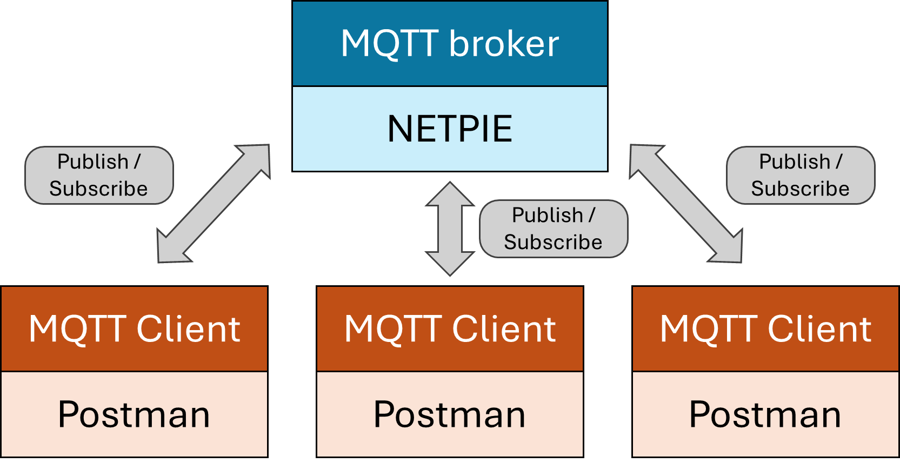
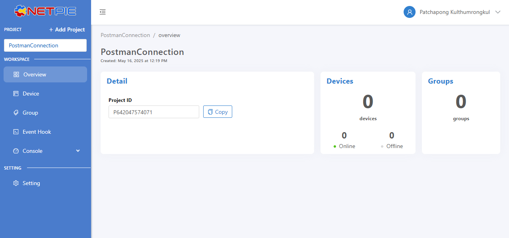
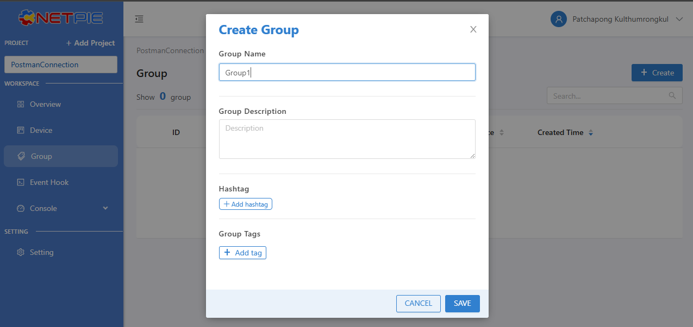
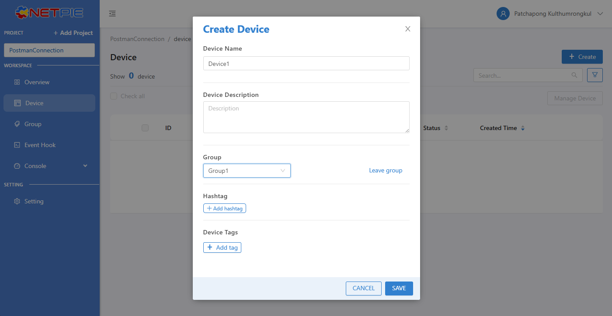
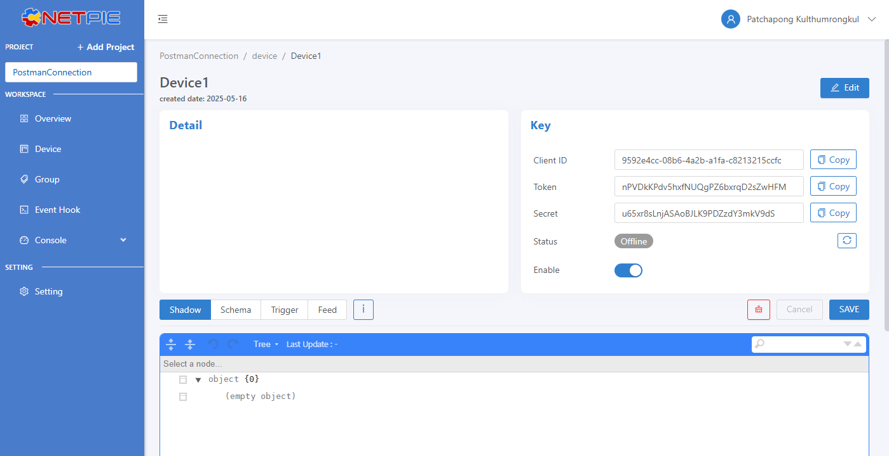
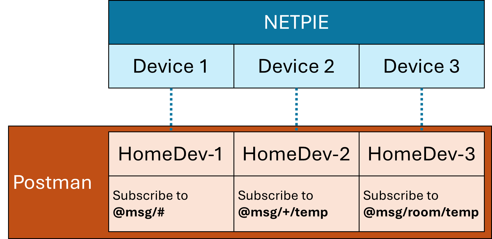

# MQTT Communication with NETPIE and Postman
This project is to tested basic device communication using MQTT for CEPT IoT intern practice.

This tutorial was created by Patchapong Kulthumrongkul patchapong.k@chula.ac.th

Center of Excellence in Electrical Power Technology, Chulalongkorn University, Thailand

## Overview
We will establish an MQTT connection using NETPIE as the MQTT broker and Postman as the MQTT client. The clients are simulated to exchange data via the MQTT protocol, which follows a publish-subscribe architecture based on topics. Only clients that subscribe to a specific topic will receive the payload published to that topic. In the following steps, you will connect the MQTT client to NETPIE.

## Getting start on NETPIE
Sign up on https://auth.netpie.io/signup > Activate Account > Login at https://auth.netpie.io/login

Add new project

Create Device Group. Only devices in the same group can communicate to each other.

Create a new device which belongs to that group.

You'll get the **Client ID, Token, and Secret** for the MQTT connection.

## Postman Installation
Go to https://www.postman.com/downloads/. Download the installer corresponding to your local OS and install it

## Examples of connecting MQTT via Postman
After installation is done, launch the Postman and create new **Blank Collection** to store the lists of MQTT requests
In this example, we create the collection named "MQTT-NETPIE"

Next, we are going to add a new MQTT request

Likewise in **MQTTBox**, we need to specify the required configuration information including MQTT Version, Host, Client ID, and Token in order to connect to the instance in the Host. 

Before we are going to connect to the Host, let's save the request to "MQTT-NETPIE" collection so that you can use this request later. 
In this example, we save the request named "HomeDev-1"

Connect to NETPIE

If everything is fine, you should see the status labeled as **connected**

Now we are going to **subscribe** to the topic "@msg/sensor". The response should show "Subscribe to [Your Topic]"

Next we are going to **publish** a message to the topic "@msg/sensor". You should see the response stating that the published message is published and the subscribed message is received

## Try it by yourself

1. **Add two more devices** in **NETPIE**:
   - `Device2`
   - `Device3`

2. In **Postman**, create two additional MQTT clients:
   - `HomeDev-2`
   - `HomeDev-3`

3. **Subscribe** each client to its **assigned topic**.

4. **Publish a message** to the topic: `@msg/room/temp`

5. **Observe**:  
- Can `HomeDev-1`, `HomeDev-2` and `HomeDev-3` receive the message, even if their subscribed topic names are not exactly `@msg/room/temp`?
- How about if we publish to `@msg/kitchen/temp` or `@msg/room/humid`? What will happen?

6. **Try your own experiments** to better understand how MQTT works, especially how topic matching and wildcards operate.