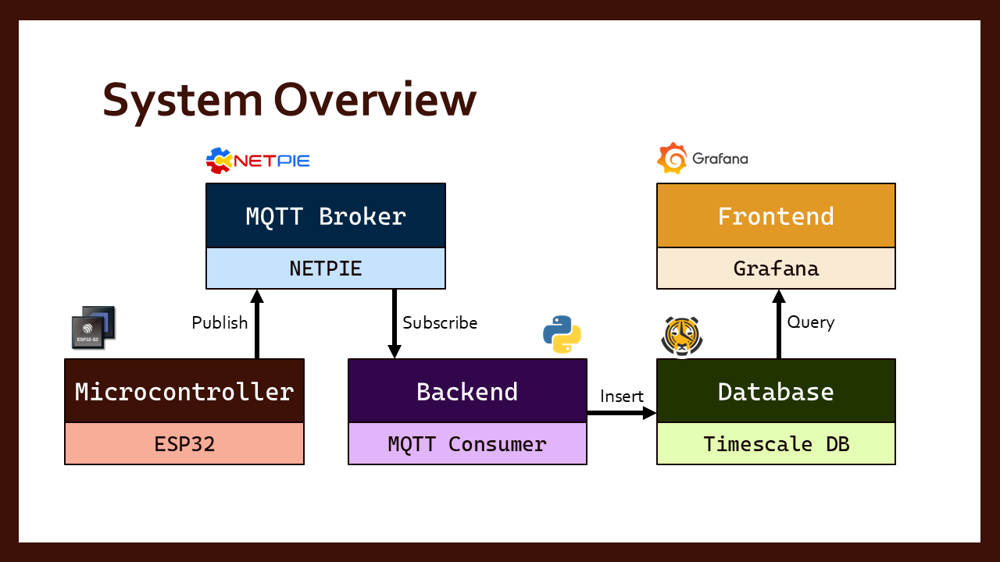

# IoT Stack Implementation

The goal of this tutorial is to understand how each stack of IoT system can be integrated with each other including Data Acquisition, Database, Backend, Frontend for CEPT IoT intern practice.

Center of Excellence in Electrical Power Technology, Chulalongkorn University, Thailand

## System Overview

#### Data Acquisition
A microcontroller unit (MCU), such as an ESP32, is used to collect sensor data (e.g., temperature, humidity). The MCU connects to a message broker using the MQTT protocol, a lightweight publish-subscribe messaging model. The device periodically publishes sensor readings to a designated MQTT topic, enabling real-time data transmission to interested subscribers.

#### Backend
A backend application, implemented in a high-level programming language like Python, acts as a data consumer. It subscribes to the MQTT topic and receives incoming sensor data. Once received, the data is parsed, and then forwarded to a time-series database for storage and future analysis.

#### Database
The database is optimized for time-series data, making it efficient for storing timestamped sensor readings. This allows for structured storage of historical data. The data becomes available for both real-time and historical monitoring.

#### Frontend 
The frontend dashboard queries the database and visualizes the data. This interface allows users to interactively explore sensor trends over time through graphs, charts, or tables.

## Preparation Before the Session

**Please bring your laptop to the session — it will be hands-on. Make sure to install the following dependencies in advance:**

1. **Docker Desktop:** [Download here](https://www.docker.com/products/docker-desktop/)  
2. **Arduino IDE:** [Installation guide](https://docs.arduino.cc/software/ide-v2/tutorials/getting-started/ide-v2-downloading-and-installing/)  
3. **Visual Studio Code (VS Code):** [Download here](https://code.visualstudio.com/download)  
4. **Python Setup in VS Code:** Ensure Python is installed and properly set up in VS Code. Follow this [guide](https://code.visualstudio.com/docs/languages/python#_install-python-and-the-python-extension)  
5. **Postman:** Make sure Postman is installed. (It should already be installed if you’ve tried this step earlier: [MQTT Experiment](https://github.com/PatchapongKul/CEPT_IoT_Intern/blob/main/Training/MQTT/training.md))
